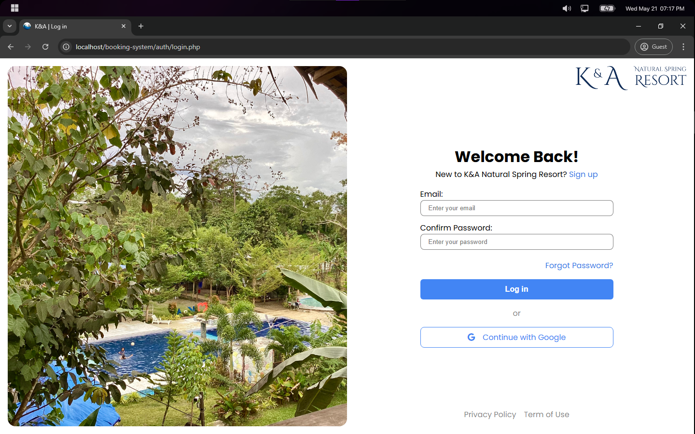

# K&A Resort Booking System

K&A Resort Booking is a web-based application that allows guests to check room availability and book online anytime. It prevents double bookings by checking for date conflicts and requires login for both guests and staff. The system supports various payment methods and provides a centralized dashboard for resort staff to manage bookings, track revenue, and organize guest information, enhancing the reservation process.

## Key Features

- **Secure User Authentication** - Allows only authorized guests and resort staff to manage their bookings and access the system
- **Real-time Room Availability Checking** - Shows up-to-date room availability via an interactive calendar
- **Automated Conflict Detection** - Checks for overlapping bookings to prevent double reservations
- **Multiple Payment Method Support** - Supports secure payments through Paypal, e-wallets and bank transfers
- **Invoice Generation** - Automatically creates and displays detailed invoices for each booking
- **Centralized Admin Panel** - Provides a single dashboard to manage bookings, track revenue, and handle guest information

## Tech Stack

### Frontend
- HTML, CSS, JavaScript
- Font Awesome & Material Design Icons

### Backend
- PHP
- MySQL
- Composer

### Third-party Libraries
- PHP-JWT for authentication
- PHP dotenv for environment configuration
- PHPMailer for email notifications
- Google API Client for OAuth integration
- mPDF for PDF generation

## Quick Start

For installation and setup instructions, please refer to our [Setup Guide](docs/setup.md).

## Requirements

- PHP 8.2 or higher
- MySQL 10.4 or higher
- Composer
- Web browser

## Documentation

Detailed documentation is available in the [docs](docs/) folder:

- [Installation Guide](docs/installation.md) - Complete installation procedures
- [Setup Guide](docs/setup.md) - Configuration and environment setup
- [Usage Guide](docs/usage.md) - How to use the application
- [API Documentation](docs/api.md) - API endpoints and routes
- [Testing Guide](docs/testing.md) - Information about the testing suite

## Testing

The application includes a comprehensive testing suite using PHPUnit. For more information, see the [Testing Guide](docs/testing.md).

## Screenshots

## Default Accounts

### Admin Account
- Email: admin@karesort.com
- Password: admin123

### User Account
- Email: user@karesort.com
- Password: user123