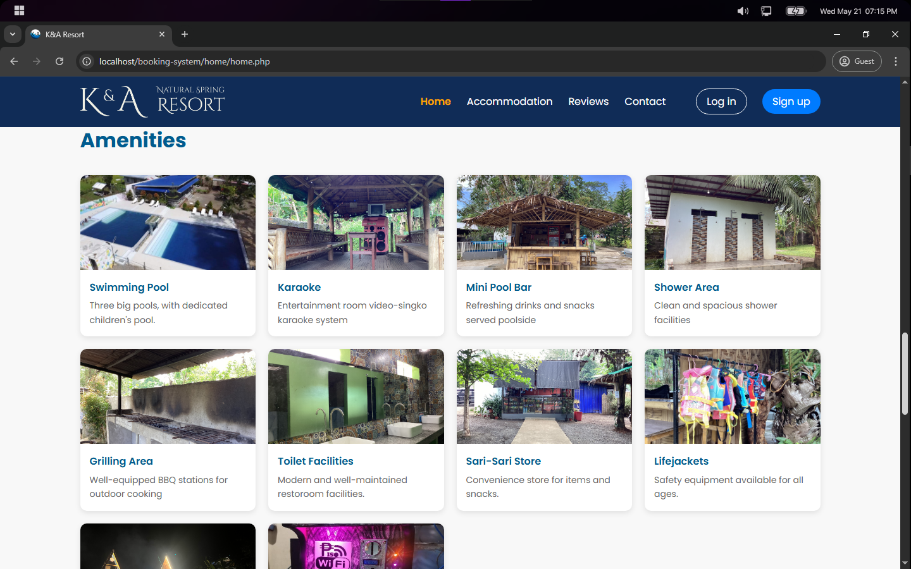
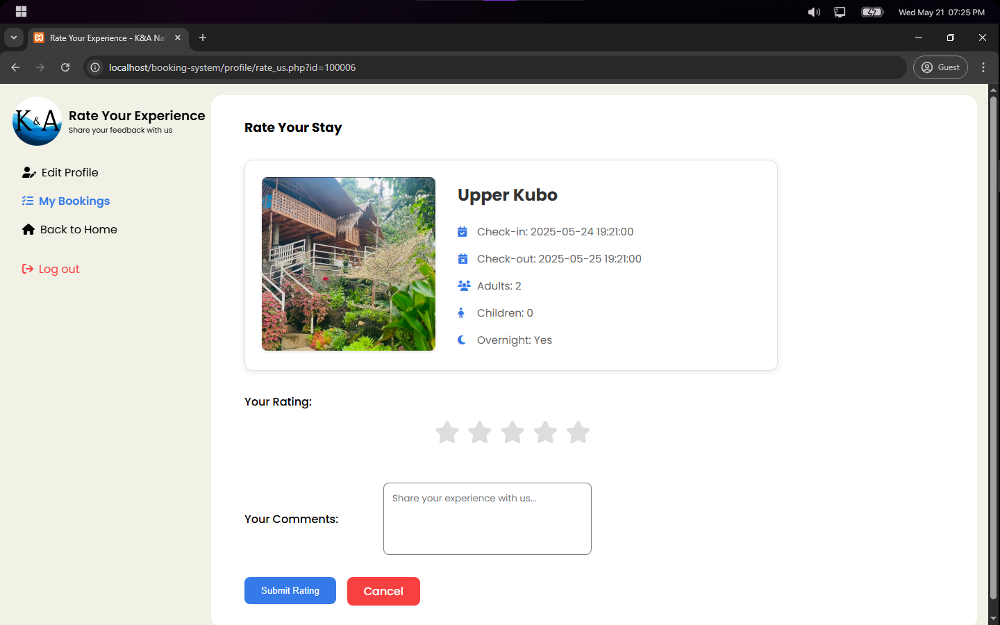

# 🏖️ K&A Resort Booking System

K&A Resort Booking is a web-based application that allows guests to check room availability and book online anytime. It prevents double bookings by checking for date conflicts and requires login for both guests and staff. The system supports various payment methods and provides a centralized dashboard for resort staff to manage bookings, track revenue, and organize guest information, enhancing the reservation process.

## 🔑 Key Features

- **Secure User Authentication**  
  Allows only authorized guests and resort staff to manage their bookings and access the system, protecting data and preventing unauthorized changes.

- **Real-time Room Availability Checking**  
  Shows up-to-date room availability via an interactive calendar for easy booking.

- **Automated Conflict Detection**  
  Checks for overlapping bookings to prevent double reservations for a specific room.

- **Multiple Payment Method Support**  
  Supports secure payments through Paypal, e-wallets and bank transfers.

- **Invoice Generation**  
  Automatically creates and displays detailed invoices for each booking to guests and resort staff.

- **Centralized Admin Panel**  
  Provides a single dashboard to manage bookings, track revenue, and handle guest information efficiently.

## ⚙️ Tech Stack

### Frontend

- **HTML** - For structuring the web pages
- **CSS** - For styling and layout
- **JavaScript** - For client-side interactivity and dynamic features
- **Font Awesome Icons** - For scalable vector icons
- **Material Design Icons** - For Google's Material Design icon set

### Backend

- **PHP** - The main server-side programming language
- **MySQL** - The database management system
- **XAMPP** - The project is running on XAMPP which provides:
  - _Apache_ web server
  - _MySQL_ database
  - _PHP_ runtime environment
- **Composer** - PHP's dependency management tool

## 📦 Packages Used

- **[PHP-JWT](https://github.com/firebase/php-jwt)** - For handling JSON Web Tokens (JWT) authentication
- **[PHP dotenv](https://github.com/vlucas/phpdotenv)** - For storing credentials and secret keys
- **[PHPMailer](https://github.com/PHPMailer/PHPMailer)** - For sending email notifications and confirmations
- **[Google API Client](https://github.com/googleapis/google-api-php-client)** - For Google authentication and API integration
- **[mPDF](https://github.com/mpdf/mpdf)** - For generating PDF documents and reports

## 🚀 Installation & Setup

### Prerequisites

- PHP 8.2 or higher
- MySQL 10.4 or higher
- Composer
- XAMPP (or similar local server stack)
- Web browser

### Step 1: Clone the Repository

```bash
git clone https://github.com/yourusername/booking-system.git
cd booking-system
```

### Step 2: Install Dependencies

```bash
composer install
```

### Step 3: Database Setup

1. Start your XAMPP server (Apache and MySQL)
2. Open phpMyAdmin (http://localhost/phpmyadmin)
3. Create a new database named `resort`
4. Import the `resort.sql` file from the project root

### Step 4: Environment Configuration

1. Create a `.env` file in the root directory
2. Copy the following configuration (update values as needed):

```env
# Database Configuration
DB_SERVERNAME=localhost
DB_USERNAME=root
DB_PASSWORD=
DB_NAME=resort

# Application Email Configuration
APP_EMAIL=your_email@gmail.com
APP_PASSWORD=your_app_password
APP_NAME=K&A Resort

# reCAPTCHA Configuration
RECAPTCHA_SITE_KEY=your_recaptcha_site_key
RECAPTCHA_SECRET_KEY=your_recaptcha_secret_key

# JWT Configuration
JWT_SECRET_KEY=your_jwt_secret_key

# Google OAuth Configuration
GOOGLE_CLIENT_ID=your_google_client_id
GOOGLE_CLIENT_SECRET=your_google_client_secret
GOOGLE_REDIRECT=http://localhost/booking-system/google-auth/callback.php
```

### Step 5: Run the Application

1. Place the project in your XAMPP's htdocs directory:

   - Windows: `C:\xampp\htdocs\booking-system`
   - Linux: `/opt/lampp/htdocs/booking-system`
   - macOS: `/Applications/XAMPP/htdocs/booking-system`

2. Start XAMPP services:

   - Apache
   - MySQL

3. Access the application:
   - Open your web browser
   - Navigate to: `http://localhost/booking-system`

### Default Admin Account

- Email: admin@karesort.com
- Password: admin123

### Troubleshooting

- If you encounter permission issues, ensure the web server has write access to the project directory
- For email functionality, make sure to use an app password if using Gmail
- If the database connection fails, verify your MySQL credentials in the `.env` file

## 📊 Database Schema

The system uses MySQL/MariaDB with the following key tables:

1. **Users and Authentication**

   - `users` - Stores user accounts (firstname, lastname, email, phone, password)
   - `role` - Manages user roles (user/admin)

2. **Room Management**

   - `room` - Contains room information (name, description, price, images)
   - Supports different room types (Upper Kubo, A-House, Cottage)

3. **Booking System**

   - `booking` - Main booking records with status tracking
   - `booking_details` - Specific booking information (check-in/out, guests)
   - `booking_invoice` - Links bookings to user invoices

4. **Payment System**
   - `payment` - Main payment records with amount and method
   - `paypal_payment` - PayPal-specific payment details
   - `gcash_payment` - GCash payment information
   - `bank_payment` - Bank transfer details

## 🔌 API Routes

### 🔐 Authentication Endpoints

| Method | Endpoint                    | Description            |
| ------ | --------------------------- | ---------------------- |
| POST   | `/auth/login.auth.php`      | User login             |
| POST   | `/auth/signup.auth.php`     | User registration      |
| POST   | `/auth/forgot-password.php` | Request password reset |
| POST   | `/auth/reset-password.php`  | Reset password         |
| POST   | `/auth/send-code.php`       | Send verification code |
| POST   | `/auth/verify.php`          | Verify user account    |
| GET    | `/auth/logout.php`          | User logout            |

### 🛠️ Admin Endpoints

| Method | Endpoint                  | Description                   |
| ------ | ------------------------- | ----------------------------- |
| GET    | `/admin/get_room.php`     | Get room details              |
| GET    | `/admin/bookings.php`     | Get all bookings              |
| GET    | `/admin/users.php`        | Get all users                 |
| GET    | `/admin/rooms.php`        | Get all rooms                 |
| GET    | `/admin/reviews.php`      | Get all reviews               |
| GET    | `/admin/view-booking.php` | View specific booking details |
| GET    | `/admin/dashboard.php`    | Get dashboard statistics      |

## 📸 Screenshots

### 🏠 Home Page


_Main banner section of the resort_


_About Us section showcasing resort information_


_Available amenities and facilities_


_Entrance rates and pricing information_

### 🏡 Accommodation


_Overview of available accommodations_


_Detailed accommodation page_

### 🔐 Authentication


_User login page_


_User registration page_

### 📅 Booking Process


_Initial booking step_


_Booking confirmation step_


_Payment processing page_


_Generated booking invoice_


_User's booking history_

### 👤 User Profile


_Profile editing interface_

### 👨‍💼 Admin Panel


_Admin dashboard overview_


_Room management interface_


_Add new room interface_


_Detailed room information management_


_Booking management interface_


_User management interface_


_Review management interface_

### ⭐ Reviews & Ratings


_User reviews section_


_Rating interface_

### 📍 Location


_Resort location map_

### 🏢 Footer


_Website footer with contact information_
