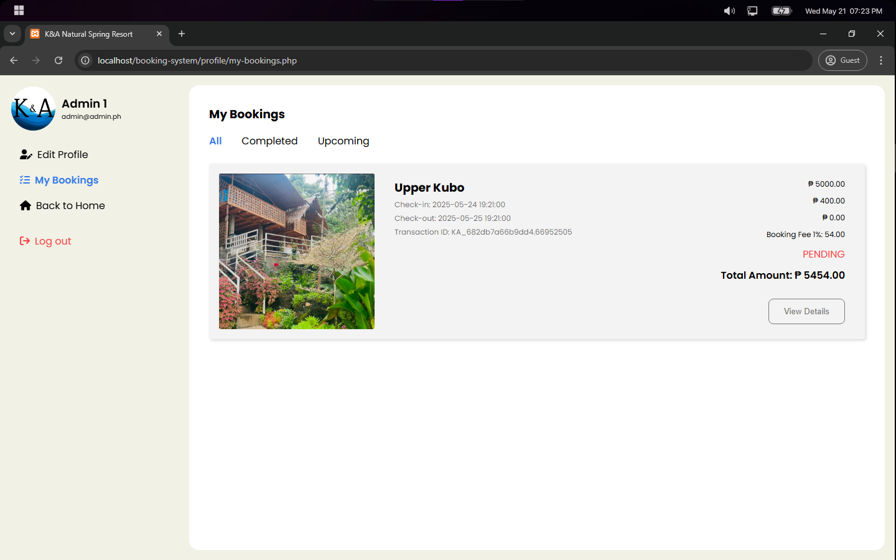

# K&A Resort Booking System

K&A Resort Booking is a web-based application that allows guests to check room availability and book online anytime. It prevents double bookings by checking for date conflicts and requires login for both guests and staff. The system supports various payment methods and provides a centralized dashboard for resort staff to manage bookings, track revenue, and organize guest information, enhancing the reservation process.

## 🔑 Key Features

- **Secure User Authentication**  
  Allows only authorized guests and resort staff to manage their bookings and access the system, protecting data and preventing unauthorized changes.

- **Real-time Room Availability Checking**  
  Shows up-to-date room availability via an interactive calendar for easy booking.

- **Automated Conflict Detection**  
  Checks for overlapping bookings to prevent double reservations for a specific room.

- **Multiple Payment Method Support**  
  Supports secure payments through Paypal, e-wallets and bank transfers.

- **Invoice Generation**  
  Automatically creates and displays detailed invoices for each booking to guests and resort staff.

- **Centralized Admin Panel**  
  Provides a single dashboard to manage bookings, track revenue, and handle guest information efficiently.

## ⚙️ Tech Stack

### Frontend

- **HTML** - For structuring the web pages
- **CSS** - For styling and layout
- **JavaScript** - For client-side interactivity and dynamic features
- **Font Awesome Icons** - For scalable vector icons
- **Material Design Icons** - For Google's Material Design icon set

### Backend

- **PHP** - The main server-side programming language
- **MySQL** - The database management system
- **Composer** - PHP's dependency management tool
- **Apache/PHP Built-in Server** - Web server options
- **Docker** - Containerization support for easy deployment

## 📦 Packages Used

- **[PHP-JWT](https://github.com/firebase/php-jwt)** - For handling JSON Web Tokens (JWT) authentication
- **[PHP dotenv](https://github.com/vlucas/phpdotenv)** - For storing credentials and secret keys
- **[PHPMailer](https://github.com/PHPMailer/PHPMailer)** - For sending email notifications and confirmations
- **[Google API Client](https://github.com/googleapis/google-api-php-client)** - For Google authentication and API integration
- **[mPDF](https://github.com/mpdf/mpdf)** - For generating PDF documents and reports

## 🚀 Installation & Setup

You can run this application using either the PHP built-in server or Docker. Choose the option that best suits your needs.

---

## Option 1: PHP Built-in Server (Simplest)

### Prerequisites

- PHP 8.2 or higher
- MySQL 10.4 or higher (or MariaDB)
- Composer
- Web browser

### Step 1: Install PHP

Download and install PHP 8.2+ from [php.net](https://windows.php.net/download)

**Windows:**
1. Download the Thread Safe ZIP package
2. Extract to `C:\php`
3. Add `C:\php` to your system PATH
4. Copy `php.ini-development` to `php.ini`
5. Enable required extensions in `php.ini`:
   ```ini
   extension=mysqli
   extension=pdo_mysql
   extension=mbstring
   extension=openssl
   extension=curl
   extension=gd
   ```

**Linux/macOS:**
```bash
# Ubuntu/Debian
sudo apt install php8.2 php8.2-mysql php8.2-mbstring php8.2-curl php8.2-gd

# macOS (using Homebrew)
brew install php@8.2
```

### Step 2: Install MySQL

**Windows:** Download from [mysql.com](https://dev.mysql.com/downloads/installer/)

**Linux:**
```bash
sudo apt install mysql-server
sudo mysql_secure_installation
```

**macOS:**
```bash
brew install mysql
brew services start mysql
```

### Step 3: Install Composer

Download from [getcomposer.org](https://getcomposer.org/download/)

### Step 4: Clone the Repository

```bash
git clone https://github.com/yourusername/booking-system.git
cd booking-system
```

### Step 5: Install Dependencies

```bash
composer install
```

### Step 6: Database Setup

1. Start MySQL service
2. Create database and import schema:

```bash
# Login to MySQL
mysql -u root -p

# Create database
CREATE DATABASE resort;
exit;

# Import the SQL file
mysql -u root -p resort < resort.sql
```

### Step 7: Environment Configuration

Create a `.env` file in the root directory:

```env
# Database Configuration
DB_SERVERNAME=localhost
DB_USERNAME=root
DB_PASSWORD=your_mysql_password
DB_NAME=resort

# Application Email Configuration
APP_EMAIL=your_email@gmail.com
APP_PASSWORD=your_app_password
APP_NAME=K&A Resort

# reCAPTCHA Configuration
RECAPTCHA_SITE_KEY=your_recaptcha_site_key
RECAPTCHA_SECRET_KEY=your_recaptcha_secret_key

# JWT Configuration
JWT_SECRET_KEY=your_jwt_secret_key

# Google OAuth Configuration
GOOGLE_CLIENT_ID=your_google_client_id
GOOGLE_CLIENT_SECRET=your_google_client_secret
GOOGLE_REDIRECT=http://localhost:8000/google-auth/google-callback.php
```

### Step 8: Run the Application

```bash
php -S localhost:8000
```

### Step 9: Access the Application

Open your browser and navigate to: `http://localhost:8000`

---

## Option 2: Docker (Recommended for Production)

### Prerequisites

- Docker Desktop (Windows/macOS) or Docker Engine (Linux)
- Docker Compose

### Step 1: Install Docker

**Windows/macOS:** Download [Docker Desktop](https://www.docker.com/products/docker-desktop)

**Linux:**
```bash
curl -fsSL https://get.docker.com -o get-docker.sh
sudo sh get-docker.sh
sudo apt install docker-compose
```

### Step 2: Clone the Repository

```bash
git clone https://github.com/yourusername/booking-system.git
cd booking-system
```

### Step 3: Create Docker Configuration

Create a `docker-compose.yml` file in the root directory:

```yaml
version: '3.8'

services:
  web:
    image: php:8.2-apache
    container_name: booking-system-web
    ports:
      - "8000:80"
    volumes:
      - .:/var/www/html
    depends_on:
      - db
    environment:
      - DB_SERVERNAME=db
      - DB_USERNAME=root
      - DB_PASSWORD=rootpassword
      - DB_NAME=resort
    command: >
      bash -c "docker-php-ext-install mysqli pdo pdo_mysql &&
               a2enmod rewrite &&
               apache2-foreground"

  db:
    image: mysql:8.0
    container_name: booking-system-db
    ports:
      - "3306:3306"
    environment:
      MYSQL_ROOT_PASSWORD: rootpassword
      MYSQL_DATABASE: resort
    volumes:
      - db_data:/var/lib/mysql
      - ./resort.sql:/docker-entrypoint-initdb.d/resort.sql

volumes:
  db_data:
```

### Step 4: Create Dockerfile (Optional - for custom PHP setup)

Create a `Dockerfile` in the root directory:

```dockerfile
FROM php:8.2-apache

RUN docker-php-ext-install mysqli pdo pdo_mysql mbstring

RUN apt-get update && apt-get install -y \
    libzip-dev \
    zip \
    unzip \
    git \
    curl

RUN docker-php-ext-install zip gd

COPY --from=composer:latest /usr/bin/composer /usr/bin/composer

WORKDIR /var/www/html

COPY . .

RUN composer install --no-dev --optimize-autoloader

RUN a2enmod rewrite

RUN chown -R www-data:www-data /var/www/html
```

### Step 5: Environment Configuration

Create a `.env` file:

```env
# Database Configuration (for Docker)
DB_SERVERNAME=db
DB_USERNAME=root
DB_PASSWORD=rootpassword
DB_NAME=resort

# Application Email Configuration
APP_EMAIL=your_email@gmail.com
APP_PASSWORD=your_app_password
APP_NAME=K&A Resort

# reCAPTCHA Configuration
RECAPTCHA_SITE_KEY=your_recaptcha_site_key
RECAPTCHA_SECRET_KEY=your_recaptcha_secret_key

# JWT Configuration
JWT_SECRET_KEY=your_jwt_secret_key

# Google OAuth Configuration
GOOGLE_CLIENT_ID=your_google_client_id
GOOGLE_CLIENT_SECRET=your_google_client_secret
GOOGLE_REDIRECT=http://localhost:8000/google-auth/google-callback.php
```

### Step 6: Build and Run with Docker

```bash
# Build and start containers
docker-compose up -d

# Install PHP dependencies inside container
docker-compose exec web composer install

# View logs
docker-compose logs -f

# Stop containers
docker-compose down
```

### Step 7: Access the Application

Open your browser and navigate to: `http://localhost:8000`

### Docker Management Commands

```bash
# Start containers
docker-compose up -d

# Stop containers
docker-compose down

# Restart containers
docker-compose restart

# View running containers
docker ps

# Access web container shell
docker-compose exec web bash

# Access MySQL container
docker-compose exec db mysql -u root -p
```

---

### Default Admin Account

- Email: admin@karesort.com
- Password: admin123

### Default User Account

- Email: user@karesort.com
- Password: user123

### Troubleshooting

- If you encounter permission issues, ensure the web server has write access to the project directory
- For email functionality, make sure to use an app password if using Gmail
- If the database connection fails, verify your MySQL credentials in the `.env` file

## 📊 Database Schema

The system uses MySQL/MariaDB with the following key tables:

1. **Users and Authentication**

   - `users` - Stores user accounts (firstname, lastname, email, phone, password)
   - `role` - Manages user roles (user/admin)

2. **Room Management**

   - `room` - Contains room information (name, description, price, images)
   - Supports different room types (Upper Kubo, A-House, Cottage)

3. **Booking System**

   - `booking` - Main booking records with status tracking
   - `booking_details` - Specific booking information (check-in/out, guests)
   - `booking_invoice` - Links bookings to user invoices

4. **Payment System**
   - `payment` - Main payment records with amount and method
   - `paypal_payment` - PayPal-specific payment details
   - `gcash_payment` - GCash payment information
   - `bank_payment` - Bank transfer details

## 🔌 API Routes

### 🔐 Authentication Endpoints

| Method | Endpoint                    | Description            |
| ------ | --------------------------- | ---------------------- |
| POST   | `/auth/login.auth.php`      | User login             |
| POST   | `/auth/signup.auth.php`     | User registration      |
| POST   | `/auth/forgot-password.php` | Request password reset |
| POST   | `/auth/reset-password.php`  | Reset password         |
| POST   | `/auth/send-code.php`       | Send verification code |
| POST   | `/auth/verify.php`          | Verify user account    |
| GET    | `/auth/logout.php`          | User logout            |

### 🛠️ Admin Endpoints

| Method | Endpoint                  | Description                   |
| ------ | ------------------------- | ----------------------------- |
| GET    | `/admin/get_room.php`     | Get room details              |
| GET    | `/admin/bookings.php`     | Get all bookings              |
| GET    | `/admin/users.php`        | Get all users                 |
| GET    | `/admin/rooms.php`        | Get all rooms                 |
| GET    | `/admin/reviews.php`      | Get all reviews               |
| GET    | `/admin/view-booking.php` | View specific booking details |
| GET    | `/admin/dashboard.php`    | Get dashboard statistics      |

## 📸 Screenshots

### 🏠 Home Page


_Main banner section of the resort_


_About Us section showcasing resort information_


_Available amenities and facilities_


_Entrance rates and pricing information_

### 🏡 Accommodation


_Overview of available accommodations_


_Detailed accommodation page_

### 🔐 Authentication


_User login page_


_User registration page_

### 📅 Booking Process


_Initial booking step_


_Booking confirmation step_


_Payment processing page_


_Generated booking invoice_


_User's booking history_

### 👤 User Profile


_Profile editing interface_

### 👨‍💼 Admin Panel


_Admin dashboard overview_


_Room management interface_


_Add new room interface_


_Detailed room information management_


_Booking management interface_


_User management interface_


_Review management interface_

### ⭐ Reviews & Ratings


_User reviews section_


_Rating interface_

### 📍 Location


_Resort location map_

### 🏢 Footer


_Website footer with contact information_
